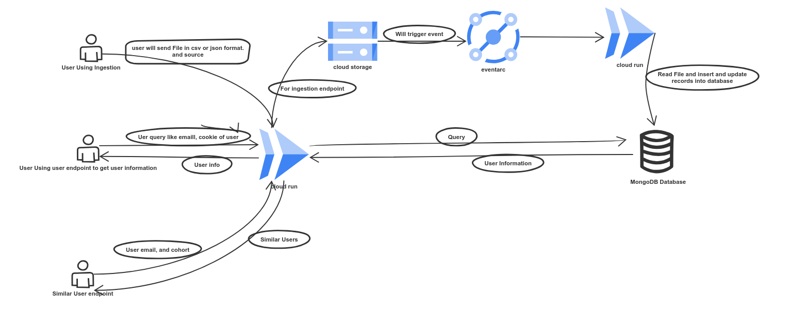

```markdown
# 🚀 User Data Ingestion and Similarity API

This project provides a set of Cloud Run-based APIs for ingesting user data, retrieving user information, and finding similar users using vector embeddings.

---

## 📦 Tech Stack

- **Python**
- **Flask**
- **Google Cloud Platform**
  - Cloud Run
  - Cloud Storage
  - Eventarc
- **MongoDB Atlas**
- **OpenAI API (for embeddings)**

---

## 🧱 Folder Structure

```
.
├── api/                    # Flask app with Dockerfile for Cloud Run
├── Second Cloud Function.py/    # Triggered by Eventarc to process GCS uploads
│            
├── triggers.js            # MongoDB trigger to generate embeddings
└── requirements.txt
```

---

## 🚀 Deployment Guide

### 1. Set Up GCP Bucket

Create a GCP bucket that will be used to dump uploaded files:

```bash
gsutil mb -p [PROJECT_ID] gs://[YOUR_BUCKET_NAME]
```

### 2. Configure the API Code

- Go to the `api/` folder
- Replace the placeholder GCP bucket name in the code with your actual bucket name

### 3. Deploy API Service to Cloud Run

- Push the repo to GitHub
- Deploy the `api/` service to Cloud Run via the GitHub repo

> 💡 Make sure to enable Cloud Build and Cloud Run services in your GCP project.

### 4. Grant Permissions to Service Account

Give the deployed Cloud Run service account permission to write to the GCP bucket:

```bash
gcloud projects add-iam-policy-binding [PROJECT_ID] \
  --member="serviceAccount:[SERVICE_ACCOUNT_EMAIL]" \
  --role="roles/storage.objectAdmin"
```

---

### 5. Deploy Second Cloud Run Function

Deploy the second service using `second_function/cloud.py`. This service will be triggered by Eventarc:

- Create a new Cloud Run service for it
- Deploy it as you did with the main API

---

### 6. Configure Eventarc Trigger

Create an Eventarc trigger that listens to the GCP bucket and calls the second Cloud Run service:

```bash
gcloud eventarc triggers create file-upload-trigger \
  --destination-run-service=[SECOND_FUNCTION_NAME] \
  --destination-run-region=[REGION] \
  --event-filters="type=google.cloud.storage.object.v1.finalized" \
  --event-filters="bucket=[YOUR_BUCKET_NAME]" \
  --service-account=[SERVICE_ACCOUNT_EMAIL]
```

---

### 7. Set Up MongoDB Atlas

- Create a MongoDB cluster on [MongoDB Atlas](https://www.mongodb.com/cloud/atlas)
- Set up a database and collection
- Enable **Triggers** and paste the content from `triggers.js` to handle embedding generation

---

## 🔌 API Endpoints

### 1. `/ingestion`

**Method:** `POST`  
**Description:** Upload a CSV or JSON file. The file is dumped into GCP bucket and processed into MongoDB.


---

### 2. `/user`

**Method:** `GET`  
**Query Params:** `email` or `cookie`  
**Description:** Retrieve user data by email or cookie.


---

### 3. `/similar-user`

**Method:** `GET`  
**Query Params:** `email` or `cookie`  
**Description:** Returns users similar to the provided user based on embeddings.

---

## System Desing



## 📝 Notes

- Make sure your MongoDB connection string and OpenAI API key are securely stored (e.g., via environment variables or Secret Manager)
- Service accounts need proper access to GCS and Cloud Run
- You can extend the embeddings logic by modifying `triggers.js`
