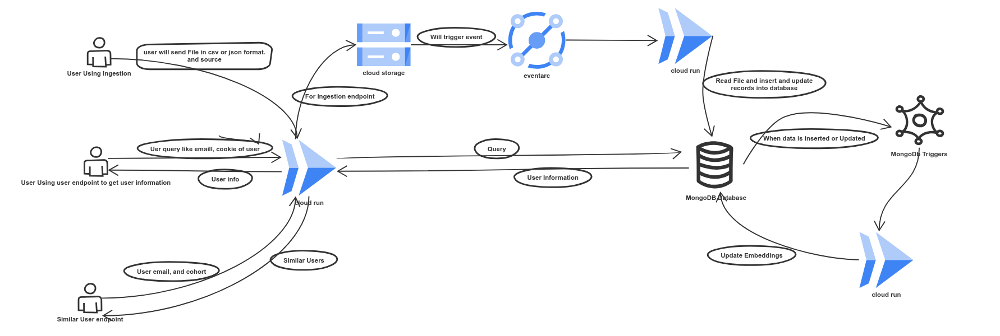
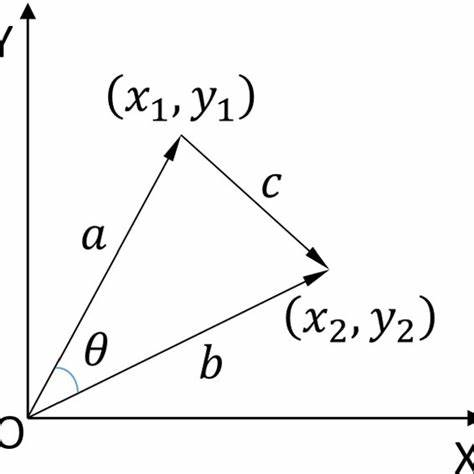

```markdown
# 🚀 User Data Ingestion and Similarity API

This project provides a set of Cloud Run-based APIs for ingesting user data, retrieving user information, and finding similar users using vector embeddings.

---

## 📦 Tech Stack

- **Python**
- **Flask**
- **Google Cloud Platform**
  - Cloud Run
  - Cloud Storage
  - Eventarc
- **MongoDB Atlas**
- **OpenAI API (for user segmentation)**
- **Cohere API (for embeddings)**

---

## 🧱 Folder Structure

```
.
├── api/                    # Flask app with Dockerfile for Cloud Run
├── Second Cloud Function.py/    # Triggered by Eventarc to process GCS uploads
│            
├── triggers.js            # MongoDB trigger to generate embeddings
└── requirements.txt
```

---

## 🚀 Deployment Guide

### 1. Set Up GCP Bucket

-Create a GCP bucket that will be used to dump uploaded files


### 2. Configure the API Code

- Go to the `api/` folder
- Replace the placeholder GCP bucket name in the code with your actual bucket name.
- This cloud run api will give us  three endpoints for ingestion, user data retrival and similar users.

### 3. Deploy API Service to Cloud Run

- Push the repo to GitHub
- Deploy the `api/` service to Cloud Run via the GitHub repo

> 💡 Make sure to enable Cloud Build and Cloud Run services in your GCP project.

### 4. Grant Permissions to Service Account

Give the deployed Cloud Run service account permission to write to the GCP bucket:

```bash
gcloud projects add-iam-policy-binding [PROJECT_ID] \
  --member="serviceAccount:[SERVICE_ACCOUNT_EMAIL]" \
  --role="roles/storage.objectAdmin"
```

---

### 5. Deploy Second Cloud Run Function

Deploy the second service using `Second Cloud Function.py`. This service will be triggered by Eventarc:

- Create a new Cloud Run Function service for it
- Deploy it as you did with the main API
- This function will clean and load data into our MongoDB database. 
- Also done user segmentation in this function.


### 6. Configure Eventarc Trigger

Create an Eventarc trigger that listens to the GCP bucket and calls the second Cloud Run service:

```bash
gcloud eventarc triggers create file-upload-trigger \
  --destination-run-service=[SECOND_FUNCTION_NAME] \
  --destination-run-region=[REGION] \
  --event-filters="type=google.cloud.storage.object.v1.finalized" \
  --event-filters="bucket=[YOUR_BUCKET_NAME]" \
  --service-account=[SERVICE_ACCOUNT_EMAIL]
```

---

### 7. Set Up MongoDB Atlas

-Create MongoDB atlas cluster which will we use to store cleaned user data.
- We are using MongoDB because it provide vector search which ww will using for finding similar users.
- Set up a database and collection

### 8. Setup Triggers for MongoDB

- Setup Triggers using triggers.js file for update and insert action in collection.
- Create trigger function using Trigger_Function.py update url into mongodb triggers.
-This trigger will add embeddings to document when it is updated or new document inserted into database.

### 9. User segmentation 

- We areusing openai model for user segmentation by doing prompt enginnering.
- We can improve model result by fine tuning model.
- TO fine tune the model create data accoring to result you want. e.g. prompt : response
- Train model on that data and use fine tuned model for user segmentation.

### EDA 

- In eda.ipynb file we have done some eda to uncover relation between different datapoints.


## 🔌 API Endpoints

### 1. `/upload'`

**Method:** `POST`  
**Description:** Upload a CSV or JSON file. The file is dumped into GCP bucket and processed into MongoDB.

---

### 2. `/user`

**Method:** `GET`  
**Query Params:** `email` or `cookie`  
**Description:** Retrieve user data by email or cookie.

---

### 3. `/similar_users`

**Method:** `GET`  
**Query Params:** `email` or `cookie`  
**Description:** Returns users similar to the provided user based on embeddings.

---

## System Desing



## Similarity  Information
In this project, the `similar-user` endpoint utilizes **cosine similarity** and **MongoDB's Vector Search** to identify users with comparable profiles.

**Cosine Similarity:**
This metric measures the cosine of the angle between two vectors, indicating their directional similarity. A value of 1 signifies identical orientation (maximum similarity), 0 indicates orthogonality (no similarity), and -1 denotes opposite orientation (maximum dissimilarity). This approach is effective in high-dimensional spaces, such as user attribute embeddings. citeturn0search0

**MongoDB's Vector Search:**
MongoDB Atlas provides native support for vector search, allowing storage and querying of vector embeddings alongside operational data. This integration facilitates semantic searches within your database. citeturn0search2

By combining these technologies, the application retrieves users whose profile vectors closely align with the target user's vector, enabling efficient and accurate identification of similar users. 




## 📝 Notes

- Make sure your MongoDB connection string and OpenAI API key are securely stored (e.g., via environment variables or Secret Manager)
- Service accounts need proper access to GCS and Cloud Run
- You can extend the embeddings logic by modifying `triggers.js`
- You can use data proc clusters for function-2 which handle data cleaning and loading it into database and user segmentation
